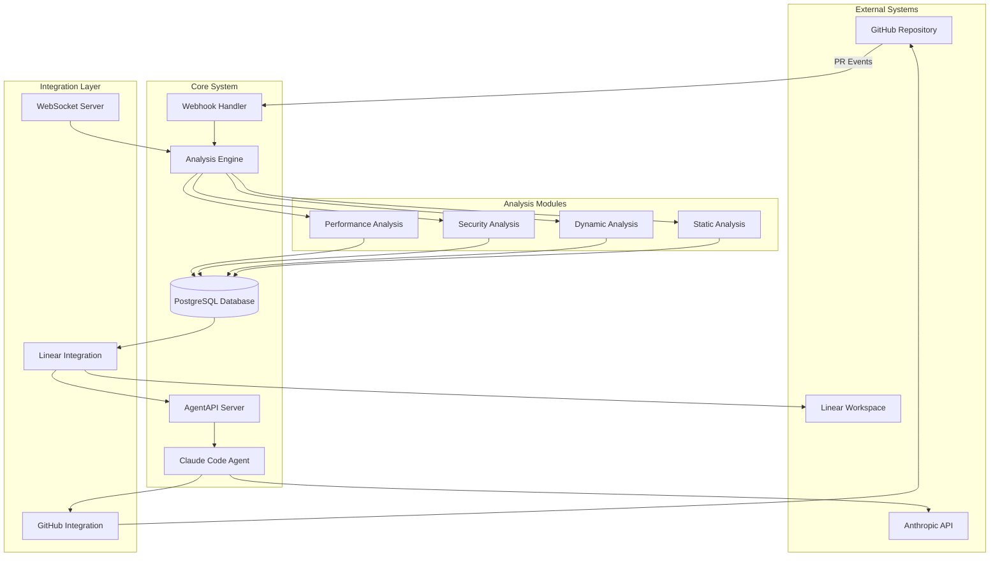
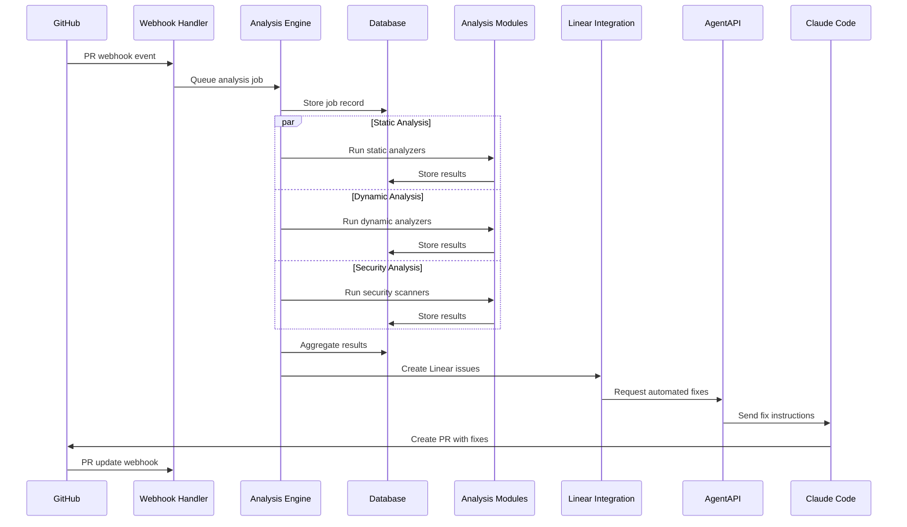

# 🏗️ System Architecture

This document provides a comprehensive overview of the PR Analysis & CI/CD Automation System architecture, including component interactions, data flow, and technical implementation details.

## 🎯 High-Level Architecture



## 🔧 Component Architecture

### 1. Webhook Handler

**Purpose**: Receives and processes GitHub webhook events for pull request activities.

**Technology Stack**:
- **Language**: Go
- **Framework**: Gin HTTP framework
- **Authentication**: HMAC-SHA256 signature verification
- **Rate Limiting**: Token bucket algorithm

**Key Responsibilities**:
- Webhook signature validation
- Event filtering and routing
- Request queuing and load balancing
- Error handling and retry logic

**API Endpoints**:
```go
// Webhook receiver
POST /webhook
GET  /webhook/health
GET  /webhook/metrics

// Management endpoints
GET  /webhook/status
POST /webhook/replay/{event_id}
```

**Configuration**:
```yaml
webhook:
  port: 8080
  secret: "${WEBHOOK_SECRET}"
  timeout: 30s
  max_payload_size: 10MB
  rate_limit:
    requests_per_minute: 100
    burst_size: 20
```

### 2. Analysis Engine

**Purpose**: Orchestrates the execution of analysis modules and manages the analysis workflow.

**Technology Stack**:
- **Language**: Go + TypeScript
- **Concurrency**: Goroutines with worker pools
- **Queue**: Redis-backed job queue
- **Caching**: Redis for intermediate results

**Architecture Pattern**: Producer-Consumer with Pipeline Processing

```go
type AnalysisEngine struct {
    moduleRegistry map[string]AnalysisModule
    jobQueue      chan AnalysisJob
    resultStore   ResultStore
    config        *Config
}

type AnalysisJob struct {
    ID           string
    PRNumber     int
    Repository   string
    HeadSHA      string
    BaseSHA      string
    Modules      []string
    Priority     Priority
    CreatedAt    time.Time
}
```

**Workflow States**:
1. **Queued**: Job received and queued for processing
2. **Running**: Analysis modules executing
3. **Completed**: All modules finished successfully
4. **Failed**: One or more modules failed
5. **Cancelled**: Job cancelled by user or system

### 3. Analysis Modules

#### Static Analysis Modules

**Unused Function Detection**
```typescript
interface UnusedFunctionAnalyzer {
  analyze(codebase: Codebase): Promise<UnusedFunctionResult>;
}

class TypeScriptUnusedFunctionAnalyzer implements UnusedFunctionAnalyzer {
  private parser: TSParser;
  private callGraphBuilder: CallGraphBuilder;
  
  async analyze(codebase: Codebase): Promise<UnusedFunctionResult> {
    const ast = await this.parser.parse(codebase.files);
    const callGraph = this.callGraphBuilder.build(ast);
    const unusedFunctions = this.findUnusedFunctions(callGraph);
    
    return {
      unusedFunctions,
      suggestions: this.generateSuggestions(unusedFunctions),
      confidence: this.calculateConfidence(unusedFunctions)
    };
  }
}
```

**Parameter Validation & Type Checking**
```typescript
class TypeValidationAnalyzer {
  private typeChecker: TypeChecker;
  
  async analyze(codebase: Codebase): Promise<TypeValidationResult> {
    const diagnostics = await this.typeChecker.check(codebase);
    const validationIssues = this.extractValidationIssues(diagnostics);
    
    return {
      typeErrors: validationIssues.typeErrors,
      parameterIssues: validationIssues.parameterIssues,
      suggestions: this.generateFixSuggestions(validationIssues)
    };
  }
}
```

#### Dynamic Analysis Modules

**Performance Hotspot Detection**
```go
type PerformanceAnalyzer struct {
    profiler    *Profiler
    tracer      *Tracer
    benchmarker *Benchmarker
}

func (p *PerformanceAnalyzer) Analyze(ctx context.Context, codebase *Codebase) (*PerformanceResult, error) {
    // Start profiling
    profile, err := p.profiler.Profile(ctx, codebase)
    if err != nil {
        return nil, err
    }
    
    // Trace execution paths
    traces, err := p.tracer.Trace(ctx, codebase)
    if err != nil {
        return nil, err
    }
    
    // Run benchmarks
    benchmarks, err := p.benchmarker.Benchmark(ctx, codebase)
    if err != nil {
        return nil, err
    }
    
    return &PerformanceResult{
        Hotspots:    p.identifyHotspots(profile, traces),
        Benchmarks:  benchmarks,
        Suggestions: p.generateOptimizations(profile, traces, benchmarks),
    }, nil
}
```

#### Security Analysis Modules

**Vulnerability Detection**
```python
class VulnerabilityScanner:
    def __init__(self):
        self.semgrep = SemgrepEngine()
        self.codeql = CodeQLEngine()
        self.custom_rules = CustomRuleEngine()
    
    async def analyze(self, codebase: Codebase) -> VulnerabilityResult:
        # Run multiple security scanners
        semgrep_results = await self.semgrep.scan(codebase)
        codeql_results = await self.codeql.scan(codebase)
        custom_results = await self.custom_rules.scan(codebase)
        
        # Merge and deduplicate results
        vulnerabilities = self.merge_results([
            semgrep_results,
            codeql_results,
            custom_results
        ])
        
        return VulnerabilityResult(
            vulnerabilities=vulnerabilities,
            severity_distribution=self.calculate_severity_distribution(vulnerabilities),
            fix_suggestions=self.generate_fix_suggestions(vulnerabilities)
        )
```

### 4. Database Schema

**PostgreSQL Schema Design**:

```sql
-- Analysis jobs and results
CREATE TABLE analysis_jobs (
    id UUID PRIMARY KEY DEFAULT gen_random_uuid(),
    pr_number INTEGER NOT NULL,
    repository VARCHAR(255) NOT NULL,
    head_sha VARCHAR(40) NOT NULL,
    base_sha VARCHAR(40) NOT NULL,
    status VARCHAR(20) NOT NULL DEFAULT 'queued',
    created_at TIMESTAMP WITH TIME ZONE DEFAULT NOW(),
    updated_at TIMESTAMP WITH TIME ZONE DEFAULT NOW(),
    completed_at TIMESTAMP WITH TIME ZONE,
    error_message TEXT,
    metadata JSONB
);

-- Analysis module results
CREATE TABLE analysis_results (
    id UUID PRIMARY KEY DEFAULT gen_random_uuid(),
    job_id UUID REFERENCES analysis_jobs(id) ON DELETE CASCADE,
    module_name VARCHAR(100) NOT NULL,
    status VARCHAR(20) NOT NULL,
    result_data JSONB,
    execution_time_ms INTEGER,
    created_at TIMESTAMP WITH TIME ZONE DEFAULT NOW()
);

-- Issues detected by analysis
CREATE TABLE detected_issues (
    id UUID PRIMARY KEY DEFAULT gen_random_uuid(),
    job_id UUID REFERENCES analysis_jobs(id) ON DELETE CASCADE,
    module_name VARCHAR(100) NOT NULL,
    issue_type VARCHAR(100) NOT NULL,
    severity VARCHAR(20) NOT NULL,
    file_path VARCHAR(500),
    line_number INTEGER,
    column_number INTEGER,
    description TEXT NOT NULL,
    suggestion TEXT,
    confidence DECIMAL(3,2),
    created_at TIMESTAMP WITH TIME ZONE DEFAULT NOW()
);

-- Linear integration tracking
CREATE TABLE linear_issues (
    id UUID PRIMARY KEY DEFAULT gen_random_uuid(),
    analysis_job_id UUID REFERENCES analysis_jobs(id) ON DELETE CASCADE,
    linear_issue_id VARCHAR(100) NOT NULL UNIQUE,
    issue_title VARCHAR(500) NOT NULL,
    issue_url VARCHAR(500) NOT NULL,
    status VARCHAR(50) NOT NULL,
    created_at TIMESTAMP WITH TIME ZONE DEFAULT NOW(),
    updated_at TIMESTAMP WITH TIME ZONE DEFAULT NOW()
);

-- AgentAPI fix tracking
CREATE TABLE agent_fixes (
    id UUID PRIMARY KEY DEFAULT gen_random_uuid(),
    linear_issue_id UUID REFERENCES linear_issues(id) ON DELETE CASCADE,
    agent_session_id VARCHAR(100) NOT NULL,
    fix_status VARCHAR(50) NOT NULL DEFAULT 'pending',
    fix_description TEXT,
    files_modified TEXT[],
    commit_sha VARCHAR(40),
    created_at TIMESTAMP WITH TIME ZONE DEFAULT NOW(),
    completed_at TIMESTAMP WITH TIME ZONE
);

-- Indexes for performance
CREATE INDEX idx_analysis_jobs_pr_repo ON analysis_jobs(pr_number, repository);
CREATE INDEX idx_analysis_jobs_status ON analysis_jobs(status);
CREATE INDEX idx_analysis_results_job_module ON analysis_results(job_id, module_name);
CREATE INDEX idx_detected_issues_job_severity ON detected_issues(job_id, severity);
CREATE INDEX idx_linear_issues_analysis_job ON linear_issues(analysis_job_id);
```

### 5. AgentAPI Integration

**Architecture**: HTTP API server that controls Claude Code through terminal emulation.

**Core Components**:
```go
type AgentAPIServer struct {
    terminal    *TerminalEmulator
    agent       Agent
    messageQueue chan Message
    eventStream  *EventStream
}

type Agent interface {
    Start(ctx context.Context) error
    SendMessage(message string) error
    GetStatus() AgentStatus
    Stop() error
}

type ClaudeCodeAgent struct {
    cmd         *exec.Cmd
    stdin       io.WriteCloser
    stdout      io.ReadCloser
    stderr      io.ReadCloser
    terminal    *TerminalEmulator
}
```

**Message Processing Pipeline**:
1. **Input Sanitization**: Clean and validate user input
2. **Terminal Emulation**: Convert API calls to terminal keystrokes
3. **Output Parsing**: Extract structured responses from terminal output
4. **State Management**: Track agent state and conversation history

### 6. Linear Integration

**GraphQL API Integration**:
```typescript
class LinearIntegration {
  private client: LinearClient;
  
  async createIssue(analysisResult: AnalysisResult): Promise<LinearIssue> {
    const mutation = `
      mutation CreateIssue($input: IssueCreateInput!) {
        issueCreate(input: $input) {
          success
          issue {
            id
            identifier
            title
            url
          }
        }
      }
    `;
    
    const variables = {
      input: {
        teamId: this.config.teamId,
        title: this.generateIssueTitle(analysisResult),
        description: this.generateIssueDescription(analysisResult),
        priority: this.mapSeverityToPriority(analysisResult.severity),
        labelIds: this.getRelevantLabels(analysisResult.type)
      }
    };
    
    const response = await this.client.request(mutation, variables);
    return response.issueCreate.issue;
  }
}
```

## 🔄 Data Flow Architecture

### 1. PR Analysis Workflow



### 2. Real-time Communication

**WebSocket Architecture**:
```typescript
class AnalysisWebSocketServer {
  private connections: Map<string, WebSocket> = new Map();
  
  broadcastAnalysisUpdate(jobId: string, update: AnalysisUpdate): void {
    const message = JSON.stringify({
      type: 'analysis_update',
      jobId,
      data: update
    });
    
    this.connections.forEach((ws, connectionId) => {
      if (this.isSubscribedToJob(connectionId, jobId)) {
        ws.send(message);
      }
    });
  }
}
```

### 3. Caching Strategy

**Multi-Level Caching**:
```go
type CacheManager struct {
    l1Cache *sync.Map           // In-memory cache
    l2Cache *redis.Client       // Redis cache
    l3Cache *PostgreSQLStore    // Database cache
}

func (c *CacheManager) Get(key string) (interface{}, error) {
    // L1: Check in-memory cache
    if value, ok := c.l1Cache.Load(key); ok {
        return value, nil
    }
    
    // L2: Check Redis cache
    if value, err := c.l2Cache.Get(key).Result(); err == nil {
        c.l1Cache.Store(key, value)
        return value, nil
    }
    
    // L3: Check database cache
    if value, err := c.l3Cache.Get(key); err == nil {
        c.l2Cache.Set(key, value, time.Hour)
        c.l1Cache.Store(key, value)
        return value, nil
    }
    
    return nil, ErrCacheNotFound
}
```

## 🔒 Security Architecture

### 1. Authentication & Authorization

**JWT-based Authentication**:
```go
type AuthMiddleware struct {
    jwtSecret []byte
    userStore UserStore
}

func (a *AuthMiddleware) ValidateToken(token string) (*User, error) {
    claims := &jwt.StandardClaims{}
    
    _, err := jwt.ParseWithClaims(token, claims, func(token *jwt.Token) (interface{}, error) {
        return a.jwtSecret, nil
    })
    
    if err != nil {
        return nil, err
    }
    
    return a.userStore.GetUser(claims.Subject)
}
```

**Role-Based Access Control**:
```yaml
rbac:
  roles:
    admin:
      permissions:
        - "analysis:create"
        - "analysis:read"
        - "analysis:delete"
        - "system:configure"
    
    developer:
      permissions:
        - "analysis:create"
        - "analysis:read"
    
    viewer:
      permissions:
        - "analysis:read"
```

### 2. Data Protection

**Encryption at Rest**:
```sql
-- Enable transparent data encryption
ALTER DATABASE pr_analysis SET encryption = 'on';

-- Encrypt sensitive columns
CREATE TABLE encrypted_secrets (
    id UUID PRIMARY KEY,
    name VARCHAR(100) NOT NULL,
    encrypted_value BYTEA NOT NULL, -- AES-256 encrypted
    created_at TIMESTAMP WITH TIME ZONE DEFAULT NOW()
);
```

**Encryption in Transit**:
- TLS 1.3 for all HTTP communications
- mTLS for internal service communication
- VPN tunneling for database connections

### 3. Input Validation & Sanitization

```go
type InputValidator struct {
    maxPayloadSize int64
    allowedEvents  map[string]bool
}

func (v *InputValidator) ValidateWebhook(payload []byte, signature string) error {
    // Size validation
    if int64(len(payload)) > v.maxPayloadSize {
        return ErrPayloadTooLarge
    }
    
    // Signature validation
    if !v.validateSignature(payload, signature) {
        return ErrInvalidSignature
    }
    
    // Content validation
    var event WebhookEvent
    if err := json.Unmarshal(payload, &event); err != nil {
        return ErrInvalidJSON
    }
    
    if !v.allowedEvents[event.Action] {
        return ErrEventNotAllowed
    }
    
    return nil
}
```

## 📊 Monitoring & Observability

### 1. Metrics Collection

**Prometheus Metrics**:
```go
var (
    analysisJobsTotal = prometheus.NewCounterVec(
        prometheus.CounterOpts{
            Name: "analysis_jobs_total",
            Help: "Total number of analysis jobs processed",
        },
        []string{"status", "repository"},
    )
    
    analysisJobDuration = prometheus.NewHistogramVec(
        prometheus.HistogramOpts{
            Name: "analysis_job_duration_seconds",
            Help: "Duration of analysis jobs",
            Buckets: prometheus.DefBuckets,
        },
        []string{"module", "repository"},
    )
)
```

### 2. Distributed Tracing

**OpenTelemetry Integration**:
```go
func (a *AnalysisEngine) ProcessJob(ctx context.Context, job *AnalysisJob) error {
    ctx, span := tracer.Start(ctx, "analysis.process_job")
    defer span.End()
    
    span.SetAttributes(
        attribute.String("job.id", job.ID),
        attribute.String("job.repository", job.Repository),
        attribute.Int("job.pr_number", job.PRNumber),
    )
    
    for _, module := range job.Modules {
        if err := a.runModule(ctx, module, job); err != nil {
            span.RecordError(err)
            span.SetStatus(codes.Error, err.Error())
            return err
        }
    }
    
    return nil
}
```

### 3. Logging Strategy

**Structured Logging**:
```go
type Logger struct {
    *logrus.Logger
}

func (l *Logger) LogAnalysisStart(jobID, repository string, prNumber int) {
    l.WithFields(logrus.Fields{
        "event":      "analysis_started",
        "job_id":     jobID,
        "repository": repository,
        "pr_number":  prNumber,
        "timestamp":  time.Now().UTC(),
    }).Info("Analysis job started")
}
```

## 🚀 Scalability Architecture

### 1. Horizontal Scaling

**Microservices Deployment**:
```yaml
# docker-compose.yml
version: '3.8'
services:
  webhook-handler:
    image: pr-analyzer/webhook-handler:latest
    replicas: 3
    ports:
      - "8080-8082:8080"
    
  analysis-engine:
    image: pr-analyzer/analysis-engine:latest
    replicas: 5
    environment:
      - WORKER_POOL_SIZE=10
    
  agentapi:
    image: pr-analyzer/agentapi:latest
    replicas: 2
    ports:
      - "3284-3285:3284"
```

### 2. Load Balancing

**NGINX Configuration**:
```nginx
upstream webhook_backend {
    least_conn;
    server webhook-1:8080 max_fails=3 fail_timeout=30s;
    server webhook-2:8080 max_fails=3 fail_timeout=30s;
    server webhook-3:8080 max_fails=3 fail_timeout=30s;
}

upstream agentapi_backend {
    ip_hash;  # Sticky sessions for WebSocket connections
    server agentapi-1:3284;
    server agentapi-2:3284;
}
```

### 3. Database Scaling

**Read Replicas & Sharding**:
```go
type DatabaseManager struct {
    master   *sql.DB
    replicas []*sql.DB
    shards   map[string]*sql.DB
}

func (dm *DatabaseManager) GetReadConnection(query string) *sql.DB {
    // Use replica for read queries
    if isReadQuery(query) {
        return dm.replicas[rand.Intn(len(dm.replicas))]
    }
    return dm.master
}

func (dm *DatabaseManager) GetShardConnection(key string) *sql.DB {
    shardKey := dm.calculateShardKey(key)
    return dm.shards[shardKey]
}
```

## 🔧 Configuration Management

### 1. Environment-based Configuration

```yaml
# config/production.yml
server:
  host: "0.0.0.0"
  port: ${PORT:8080}
  read_timeout: 30s
  write_timeout: 30s

database:
  url: ${DATABASE_URL}
  max_connections: ${DB_MAX_CONNECTIONS:20}
  connection_timeout: 30s

analysis:
  parallel_jobs: ${ANALYSIS_PARALLEL_JOBS:4}
  timeout: ${ANALYSIS_TIMEOUT:600s}
  cache_ttl: ${ANALYSIS_CACHE_TTL:3600s}

integrations:
  linear:
    api_key: ${LINEAR_API_KEY}
    team_id: ${LINEAR_TEAM_ID}
  
  anthropic:
    api_key: ${ANTHROPIC_API_KEY}
    model: ${ANTHROPIC_MODEL:claude-3-sonnet-20240229}
```

### 2. Feature Flags

```go
type FeatureFlags struct {
    EnableDynamicAnalysis    bool `json:"enable_dynamic_analysis"`
    EnableSecurityScanning   bool `json:"enable_security_scanning"`
    EnableAutoFix           bool `json:"enable_auto_fix"`
    MaxConcurrentJobs       int  `json:"max_concurrent_jobs"`
}

func (f *FeatureFlags) IsEnabled(feature string) bool {
    switch feature {
    case "dynamic_analysis":
        return f.EnableDynamicAnalysis
    case "security_scanning":
        return f.EnableSecurityScanning
    case "auto_fix":
        return f.EnableAutoFix
    default:
        return false
    }
}
```

---

This architecture is designed to be:
- **Scalable**: Horizontal scaling with microservices
- **Resilient**: Fault tolerance and error recovery
- **Secure**: Multi-layer security with encryption and authentication
- **Observable**: Comprehensive monitoring and logging
- **Maintainable**: Clean separation of concerns and modular design

